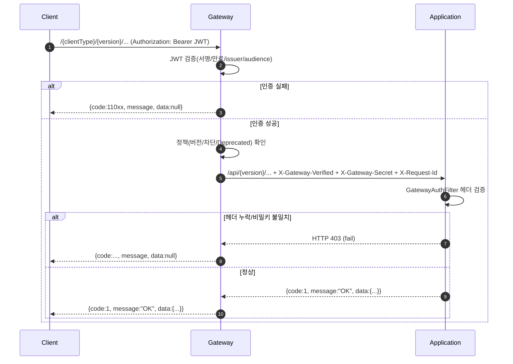
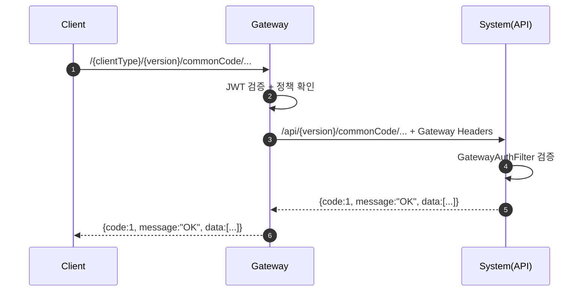
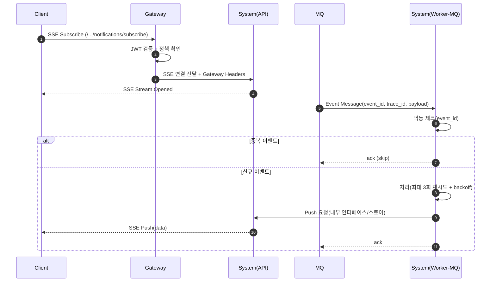
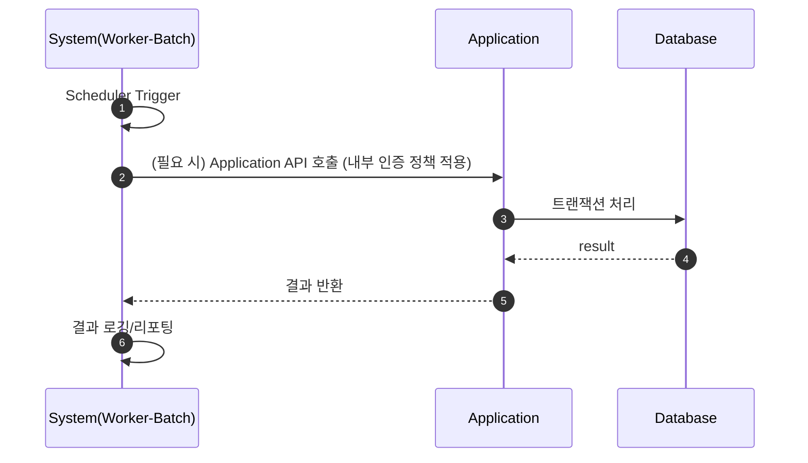
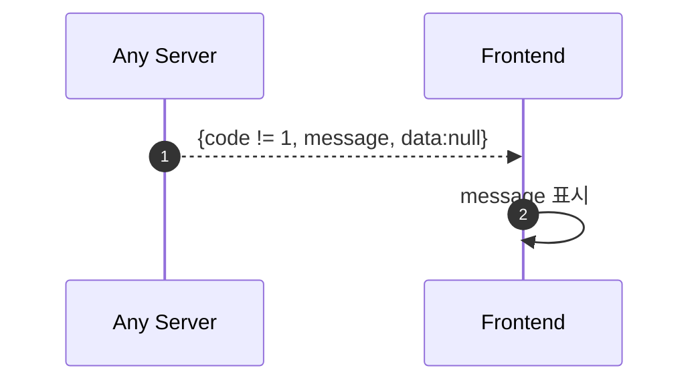

# ARCHITECTURE.md

이 문서는 EF 전체 아키텍처의 철학과 각 서버의 역할을 정의하는 전사 선언서다.
이 문서는 모든 프로젝트의 CLAUDE.md보다 상위 철학 문서다.
단, 구현 세부 규칙은 각 프로젝트 CLAUDE.md가 우선한다.

---

## 1. EF 아키텍처 철학

EF는 역할이 명확히 분리된 다중 서버 구조를 가진다.

- Edge는 정책만 수행한다.
- Business는 도메인만 수행한다.
- Worker는 시스템 기능을 수행한다.
- Database는 구조만 책임진다.
- Common은 공유 규칙만 가진다.

각 계층은 자신의 책임만 가진다.
책임을 넘어서지 않는다.

---

## 2. 서버 역할 정의

### 2.1 Gateway (Edge Layer)

- 외부 요청의 단일 진입점
- Client 타입 식별 (app / web)
- API 버전 식별
- JWT 인증(Authentication)
- 라우팅
- 차단/Deprecated 정책 적용
- API 사용량 로깅

하지 않는 것:
- 비즈니스 로직
- DB 접근
- DTO 변환
- 응답 가공
- 트랜잭션 관리

Trust Boundary:
API Server는 Gateway를 통과한 요청만 신뢰한다.
Gateway는 인증되지 않은 요청을 절대 내부 API Server로 전달하지 않는다.

### 2.2 Application (Core Business)

- 실시간 사용자 요청 처리
- 모든 비즈니스 도메인 로직 수행
- 트랜잭션 관리
- 인가 처리
- 도메인 정책 집행

계층 책임:
- controller : API 계약, 요청/응답
- service    : 비즈니스 정책, 트랜잭션 경계
- dto        : data transfer object
- dao(@Mapper) : 데이터 접근

하지 않는 것:
- JWT 인증
- Gateway 역할
- 장시간 배치 처리 (부하 분리)
- core / common / biz 역할 혼합

### 2.3 System (Worker Layer)

System은 Application 서버의 부하를 분산하는 Worker 서버다.
Profile 기반으로 역할이 분리된다.

**api Profile (8082):**
- 공통코드 API
- 알림 처리 (SSE)
- Health Check

**worker-mq Profile (8083):**
- MQ 이벤트 소비 및 처리
- 로그 적재 (발송 로그, 시스템 로그)
- 외부 API 연동 (SMS, 알림톡 등)
- 이벤트 처리 결과 기록

**worker-batch Profile (8084):**
- 배치 작업 실행
- 대용량 데이터 처리
- 정기 집계/동기화 작업
- 장시간 실행 허용

**worker-ws Profile (8085, v2 예정):**
- WebSocket 연결 관리
- 실시간 양방향 통신

**공통 - 하지 않는 것:**
- 실시간 사용자 요청 처리 (Application 책임)
- JWT 생성/검증
- 사용자 인가 처리

### 2.4 Database (Schema Layer)

- 스키마 설계
- 제약 조건 정의
- 데이터 구조 유지

하지 않는 것:
- 비즈니스 정책
- 애플리케이션 의존 설계

### 2.5 hs-common (Shared Kernel)

- 공통 ErrorCode
- 공통 DTO
- 공통 유틸

하지 않는 것:
- 특정 서버 종속 로직

---

## 3. 통신 아키텍처

### 3.1 Client → Gateway → Application 흐름

- 외부 URL: /{clientType}/{version}
- 내부 URL: /api/{version}
- clientType은 Gateway에서 제거

### 3.2 Gateway 인증 헤더

- X-Gateway-Verified
- X-Gateway-Secret

Application/System은 두 헤더 모두 검증한다.

### 3.3 통일된 응답 구조

```json
{
  "code": 1,
  "message": "OK",
  "data": {}
}
```

code == 1 → 성공
code != 1 → 실패

---

## 4. 통일 원칙

### 4.1 에러 코드 체계

형식: {프로젝트번호}{비즈니스1}{비즈니스2}{시퀀스}

| 프로젝트 | 번호 |
|----------|------|
| Gateway | 1 |
| System | 2 |
| Application | 3 |
| 공통 | 9 |

### 4.2 보안 경계 (Trust Boundary)

- 외부 요청은 Gateway에서만 인증
- Application과 System은 Gateway 헤더만 신뢰
- 공유 비밀키 검증 필수

---

## 5. 부하 분리 원칙

- Application: 실시간 사용자 트래픽 전담
- System (worker-batch): 배치 작업 전담
- System (worker-mq): 비동기 이벤트 처리 전담

목적: Application 서버의 응답 지연 방지

---

## 6. 스키마 분리 원칙

| 스키마 | 용도 |
|--------|------|
| scm_mmhr | HR 도메인 데이터 |
| scm_mmauth | 인증 데이터 |
| scm_mmpublic | 공통 데이터 |
| scm_mmlog | 로그/이력 데이터 |

서버별 접근 권한:

| 서버/Profile | scm_mmhr | scm_mmauth | scm_mmpublic | scm_mmlog |
|--------------|----------|------------|--------------|-----------|
| Application | ALL | ALL | ALL | ALL |
| System (api) | SELECT | SELECT | SELECT | SELECT |
| System (worker-log) | - | - | - | CRUD |
| System (worker-batch) | ALL | ALL | ALL | ALL |
| Gateway | - | - | - | - |

---

## 7. 시퀀스 다이어그램

### 7.1 로그인/보호 API 호출 흐름



### 7.2 공통코드 조회 (System api profile)



### 7.3 알림 구독(SSE) + 이벤트 푸시



### 7.4 Batch 실행



### 7.5 오류 응답 규칙(공통)



---

## 8. 변경 원칙

- Profile 간 책임은 명확히 분리한다.
- 한 서버의 기능 확장은 다른 서버의 책임을 침범하지 않는다.
- 경계가 모호하면 설계 재검토가 우선이다.

---

## 9. Claude 행동 원칙

Claude Code는:

1. 이 문서를 먼저 이해한다.
2. 작업 대상 프로젝트 CLAUDE.md를 읽는다.
3. _INDEX.md에 따라 필요한 문서를 선택 로딩한다.
4. 다른 서버 규칙을 임의로 적용하지 않는다.
5. Profile별 권한을 준수한다.
6. 스키마 경계를 준수한다.

---

END OF FILE
