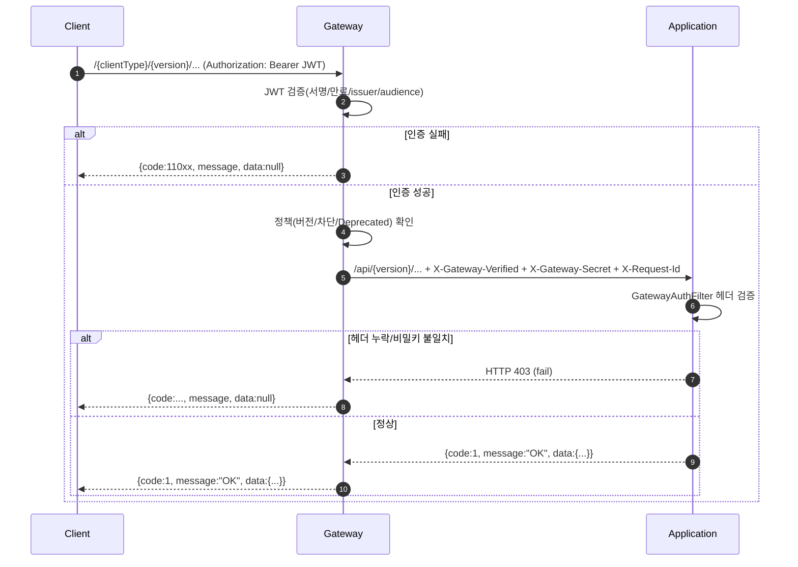
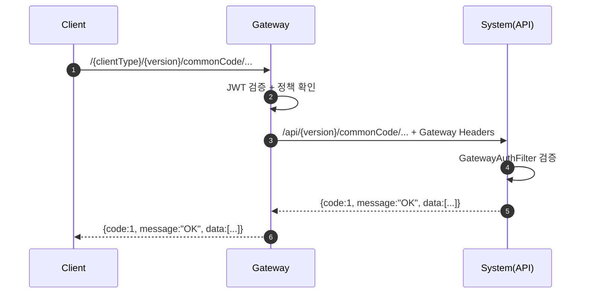
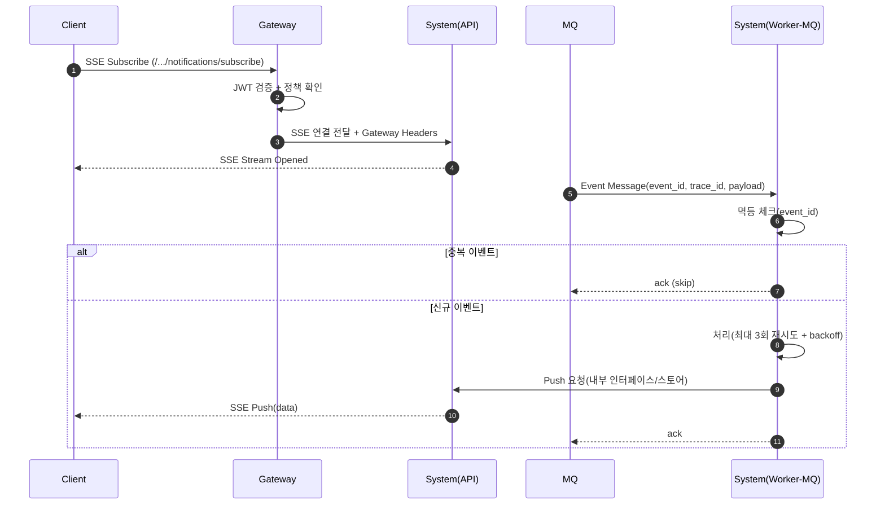
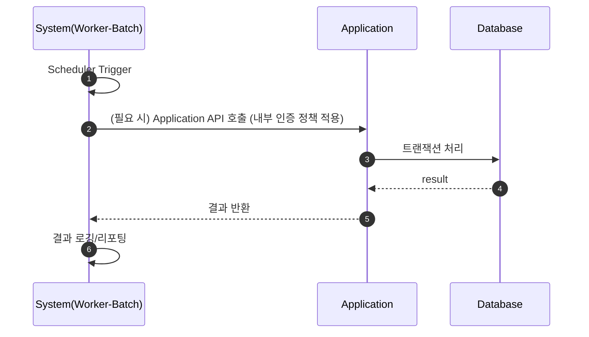
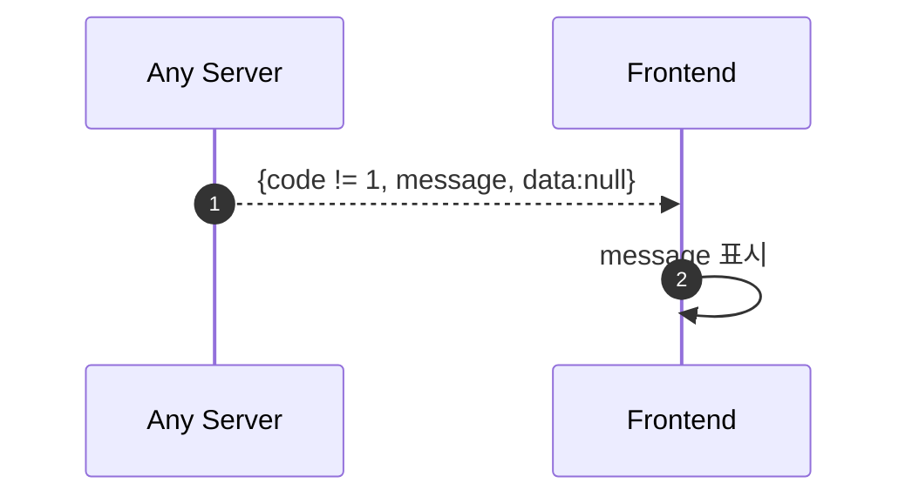

# SYSTEM_SEQUENCE_DIAGRAMS.md

이 문서는 EF 시스템 간 주요 통신 시나리오를
시퀀스 다이어그램으로 정의한다.

표기:
- Client / Gateway / Application / System / MQ / DB

---

## 1. 로그인/보호 API 호출 흐름 (Client → Gateway → Application)

## 2. 공통코드 조회 (Client → Gateway → System(api profile))

## 3. 알림 구독(SSE) + 이벤트 푸시 (Client → Gateway → System, MQ → System)

SSE는 장시간 연결이므로 “인증/세션 유지”는 Gateway 정책에 의해 통제된다.

## 4. Batch 실행 (System(worker-batch) → Application/DB)

## 5. 오류 응답 규칙(공통)

END OF FILE